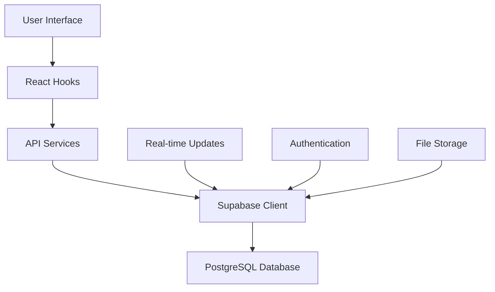
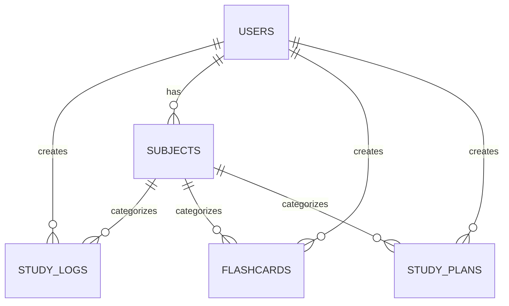

# 📚 Study Tracker - AI-Powered Learning Platform

<div align="center">


**Aplikasi pembelajaran cerdas yang membantu Anda mengoptimalkan proses belajar dengan AI**

[](https://reactjs.org/)
[](https://www.typescriptlang.org/)
[](https://tailwindcss.com/)
[](https://supabase.com/)
[](https://vitejs.dev/)

</div>

## 📋 Daftar Isi

- [🎯 Overview](#-overview)
- [✨ Fitur Utama](#-fitur-utama)
- [🚀 Quick Start](#-quick-start)
- [📱 Fitur Detail](#-fitur-detail)
- [🔧 Teknologi yang Digunakan](#-teknologi-yang-digunakan)
- [📊 Arsitektur Aplikasi](#-arsitektur-aplikasi)
- [🎨 Design System](#-design-system)
- [📱 Responsive Design](#-responsive-design)
- [🔐 Authentication](#-authentication)
- [🗄️ Database Schema](#️-database-schema)
- [🧪 Testing](#-testing)
- [🚀 Deployment](#-deployment)
- [🤝 Contributing](#-contributing)
- [📄 License](#-license)

---

## 🎯 Overview

**Study Tracker** adalah platform pembelajaran cerdas yang mengintegrasikan teknologi AI untuk membantu pelajar mengoptimalkan proses belajar mereka. Aplikasi ini menyediakan berbagai fitur canggih mulai dari perencanaan belajar, pelacakan kemajuan, hingga analisis mendalam dengan bantuan AI.

### 🎨 Tampilan Aplikasi

- **Modern UI/UX**: Desain yang clean dan modern dengan tema light dan blue accent
- **Responsive Design**: Optimal di semua device dari smartphone hingga desktop
- **Dark/Light Mode**: Dukungan tema yang dapat disesuaikan
- **Interactive Components**: Komponen UI yang responsif dan intuitif

---

## ✨ Fitur Utama

### 🏠 **Dashboard**
- Overview statistik belajar harian dan mingguan
- Progress tracking dengan visualisasi yang menarik
- Quick access ke fitur-fitur utama
- AI insights dan rekomendasi personal

### 📅 **Study Planner**
- AI-powered study planning
- Task management dengan deadline tracking
- Progress monitoring per subject
- Adaptive scheduling berdasarkan performance

### 🧠 **Flashcards & Quizzes**
- Sistem flashcard interaktif
- AI-generated questions dan answers
- Spaced repetition algorithm
- Quiz mode dengan scoring system
- Mastery tracking per topic

### 📊 **Analytics**
- Detailed study analytics dan insights
- Performance trends dan patterns
- Subject-wise breakdown
- Goal tracking dan achievement monitoring

### 🏆 **Achievements**
- Gamification system dengan badges
- Streak tracking dan milestones
- Progress celebrations
- Social sharing capabilities

### 📝 **Study Journal**
- AI-powered reflection prompts
- Mood dan productivity tracking
- Learning insights dan patterns
- Export capabilities

### 👥 **Study Groups**
- Collaborative learning features
- Group challenges dan competitions
- Shared resources dan notes
- Real-time collaboration tools

### ⚙️ **Settings & Customization**
- Profile management
- Theme customization
- Notification preferences
- Data export/import

---

## 🚀 Quick Start

### 📋 Prerequisites

- **Node.js** (v18.0 atau lebih baru)
- **npm** atau **yarn**
- **Git**

### 🔧 Installation

1. **Clone Repository**
```bash
git clone https://github.com/your-username/study-tracker.git
cd study-tracker
```

2. **Install Dependencies**
```bash
npm install
# atau
yarn install
```

3. **Environment Setup**
```bash
# Copy environment template
cp .env.example .env.local

# Edit .env.local dengan konfigurasi Anda
VITE_SUPABASE_URL=your_supabase_url
VITE_SUPABASE_ANON_KEY=your_supabase_anon_key
```

4. **Start Development Server**
```bash
npm run dev
# atau
yarn dev
```

5. **Akses Aplikasi**
```
http://localhost:5173
```

---

## 📱 Fitur Detail

### 🏠 Dashboard

#### Overview Statistik
```typescript
interface DashboardStats {
  total_hours_this_week: number;
  active_subjects: number;
  upcoming_deadlines: number;
  current_streak: number;
  goal_achievement_percentage: number;
}
```

#### Komponen Utama
- **Quick Stats Cards**: Menampilkan statistik utama dengan icon dan progress bars
- **Study Log Input**: Form untuk mencatat session belajar
- **Subject Progress**: Progress tracking per mata pelajaran
- **Study Hours Chart**: Visualisasi jam belajar dalam chart
- **Study Calendar**: Kalender dengan tasks dan deadlines
- **AI Insights**: Rekomendasi dan insights dari AI

#### Responsive Layout
```css
/* Mobile First Approach */
.dashboard-grid {
  @apply grid-cols-1 sm:grid-cols-2 lg:grid-cols-4 gap-4;
}

.dashboard-sections {
  @apply space-y-6 lg:space-y-8;
}
```

### 📅 Study Planner

#### AI-Powered Planning
- **Smart Scheduling**: AI menganalisis pola belajar dan memberikan jadwal optimal
- **Adaptive Planning**: Menyesuaikan jadwal berdasarkan performance dan preferences
- **Task Breakdown**: Memecah goal besar menjadi task-task kecil yang manageable

#### Study Plan Structure
```typescript
interface StudyPlan {
  id: string;
  title: string;
  subject: string;
  duration: number; // in hours
  difficulty: 'easy' | 'medium' | 'hard';
  deadline: string;
  description: string;
  completed: boolean;
  tasks: StudyTask[];
  created_at: string;
  updated_at: string;
}

interface StudyTask {
  id: string;
  title: string;
  estimated_time: number; // in minutes
  completed: boolean;
  scheduled_date: string;
  priority: 'low' | 'medium' | 'high';
}
```

#### Features
- **Create New Plan**: Form untuk membuat study plan baru
- **AI Generation**: Generate plan otomatis dengan AI
- **Progress Tracking**: Monitor progress setiap plan dan task
- **Calendar Integration**: Integrasi dengan calendar view
- **Reminder System**: Notifikasi untuk deadlines dan tasks

### 🧠 Flashcards & Quizzes

#### Flashcard System
```typescript
interface Flashcard {
  id: string;
  question: string;
  answer: string;
  subject: string;
  difficulty: 'easy' | 'medium' | 'hard';
  mastery: number; // 0-100
  last_reviewed: string;
  created_at: string;
  tags: string[];
  hint?: string;
  explanation?: string;
}
```

#### Study Modes
1. **Browse Mode**: Browse semua flashcards dengan filter
2. **Study Mode**: Active recall dengan spaced repetition
3. **Quiz Mode**: Multiple choice questions dengan scoring

#### AI Features
- **Auto Generation**: Generate flashcards dari text atau topic
- **Difficulty Assessment**: AI menilai tingkat kesulitan
- **Personalized Review**: Schedule review berdasarkan performance
- **Smart Hints**: AI-generated hints untuk membantu recall

#### Spaced Repetition Algorithm
```typescript
interface SpacedRepetition {
  interval: number; // days until next review
  repetition: number; // current repetition count
  ease_factor: number; // difficulty multiplier
  next_review: string;
}
```

### 📊 Analytics

#### Performance Metrics
```typescript
interface AnalyticsData {
  study_time: {
    daily: TimeData[];
    weekly: TimeData[];
    monthly: TimeData[];
  };
  subject_performance: SubjectPerformance[];
  productivity_trends: ProductivityData[];
  goal_achievements: GoalData[];
  learning_velocity: VelocityData;
}
```

#### Visualizations
- **Line Charts**: Study time trends
- **Bar Charts**: Subject comparison
- **Pie Charts**: Time distribution
- **Heatmaps**: Activity patterns
- **Progress Bars**: Goal achievements

#### Insights & Recommendations
- **Peak Performance Times**: Waktu terbaik untuk belajar
- **Subject Weaknesses**: Area yang perlu diperbaiki
- **Study Pattern Analysis**: Analisis pola belajar
- **Goal Recommendations**: Saran goal yang realistis

### 🏆 Achievements

#### Achievement System
```typescript
interface Achievement {
  id: string;
  title: string;
  description: string;
  icon: string;
  category: 'streak' | 'time' | 'subject' | 'social';
  requirements: AchievementRequirement[];
  reward: AchievementReward;
  unlocked_at?: string;
}
```

#### Achievement Categories
- **Streak Achievements**: Consistency rewards
- **Time Achievements**: Study time milestones
- **Subject Achievements**: Subject-specific accomplishments
- **Social Achievements**: Group and sharing rewards

#### Gamification Features
- **Badge System**: Visual rewards untuk achievements
- **Streak Tracking**: Daily consistency tracking
- **Leaderboards**: Friendly competition
- **Progress Celebrations**: Animated celebrations

### 📝 Study Journal

#### AI-Powered Reflections
```typescript
interface JournalEntry {
  id: string;
  date: string;
  mood: 'excellent' | 'good' | 'okay' | 'poor';
  productivity: number; // 1-10
  reflection: string;
  ai_insights: AIInsight[];
  tags: string[];
  attachments?: string[];
}
```

#### AI Insights
- **Mood Analysis**: Analisis mood dan productivity patterns
- **Learning Insights**: Identifikasi learning patterns
- **Recommendation Engine**: Saran untuk improvement
- **Progress Predictions**: Prediksi kemajuan belajar

### 👥 Study Groups

#### Collaborative Features
```typescript
interface StudyGroup {
  id: string;
  name: string;
  description: string;
  subjects: string[];
  members: GroupMember[];
  challenges: GroupChallenge[];
  resources: SharedResource[];
  created_at: string;
}
```

#### Group Activities
- **Shared Flashcards**: Collaborative flashcard creation
- **Group Challenges**: Weekly/monthly challenges
- **Resource Sharing**: Share materials dan notes
- **Real-time Chat**: Communication tools
- **Progress Sharing**: Compare progress dengan group

### ⚙️ Settings & Profile

#### Profile Management
```typescript
interface UserProfile {
  id: string;
  email: string;
  full_name: string;
  avatar_url?: string;
  preferences: UserPreferences;
  goals: UserGoal[];
  subjects: UserSubject[];
  created_at: string;
}
```

#### Customization Options
- **Theme Settings**: Light/Dark mode
- **Notification Preferences**: Customize notifications
- **Privacy Settings**: Control data sharing
- **Export/Import**: Data portability

---

## 🔧 Teknologi yang Digunakan

### 🎨 Frontend
- **React 18**: UI framework dengan hooks dan functional components
- **TypeScript**: Type safety dan better developer experience
- **Tailwind CSS**: Utility-first CSS framework
- **Shadcn/ui**: Pre-built accessible components
- **Lucide React**: Beautiful icon library
- **React Router DOM**: Client-side routing
- **React Query**: Data fetching dan caching
- **React Hook Form**: Form handling
- **Framer Motion**: Animations (optional)

### 🔧 Build Tools
- **Vite**: Fast build tool dan development server
- **ESLint**: Code linting
- **Prettier**: Code formatting
- **TypeScript Compiler**: Type checking

### 🗄️ Backend & Database
- **Supabase**: Backend-as-a-Service
  - PostgreSQL database
  - Real-time subscriptions
  - Authentication
  - Storage
  - Edge functions

### 📱 PWA Features
- **Service Workers**: Offline functionality
- **Web App Manifest**: App-like experience
- **Push Notifications**: Engagement features

---

## 📊 Arsitektur Aplikasi

### 🏗️ Folder Structure
```
src/
├── components/           # Reusable UI components
│   ├── ui/              # Base UI components (shadcn)
│   ├── auth/            # Authentication components
│   ├── layout/          # Layout components
│   └── feature/         # Feature-specific components
├── hooks/               # Custom React hooks
├── lib/                 # Utility functions
├── pages/               # Page components
├── services/            # API services
├── types/               # TypeScript type definitions
└── styles/              # Global styles
```

### 🔄 Data Flow


### 🎯 Component Architecture
```typescript
// Example: Dashboard Component Structure
const Dashboard = () => {
  // Custom hooks for data fetching
  const { data, loading, error } = useDashboard();
  const { user } = useAuth();
  
  // Local state for UI interactions
  const [sidebarOpen, setSidebarOpen] = useState(false);
  
  // Render with responsive layout
  return (
    <ResponsiveLayout>
      <DashboardStats stats={data?.stats} />
      <StudyLogInput />
      <SubjectProgress subjects={data?.subjects} />
      <StudyHoursChart data={data?.chartData} />
    </ResponsiveLayout>
  );
};
```

---

## 🎨 Design System

### 🎨 Color Palette
```css
/* Primary Colors */
--primary: 214 100% 50%;      /* Blue */
--primary-foreground: 0 0% 100%;

/* Secondary Colors */
--secondary: 210 40% 96%;     /* Light Blue */
--secondary-foreground: 222 84% 5%;

/* Accent Colors */
--accent: 142 76% 36%;        /* Green */
--accent-foreground: 0 0% 100%;

/* Background */
--background: 0 0% 100%;      /* White */
--foreground: 222 84% 5%;     /* Dark */

/* Muted */
--muted: 210 40% 96%;         /* Light Gray */
--muted-foreground: 215 16% 47%;
```

### 📐 Typography Scale
```css
/* Font Sizes */
--text-xs: 0.75rem;     /* 12px */
--text-sm: 0.875rem;    /* 14px */
--text-base: 1rem;      /* 16px */
--text-lg: 1.125rem;    /* 18px */
--text-xl: 1.25rem;     /* 20px */
--text-2xl: 1.5rem;     /* 24px */
--text-3xl: 1.875rem;   /* 30px */
```

### 📏 Spacing System
```css
/* Spacing Scale */
--space-1: 0.25rem;     /* 4px */
--space-2: 0.5rem;      /* 8px */
--space-3: 0.75rem;     /* 12px */
--space-4: 1rem;        /* 16px */
--space-6: 1.5rem;      /* 24px */
--space-8: 2rem;        /* 32px */
--space-12: 3rem;       /* 48px */
```

### 🎭 Component Variants
```typescript
// Button Variants
type ButtonVariant = 
  | 'default' 
  | 'destructive' 
  | 'outline' 
  | 'secondary' 
  | 'ghost' 
  | 'link';

// Card Variants
type CardVariant = 
  | 'default' 
  | 'elevated' 
  | 'outlined';
```

---

## 📱 Responsive Design

### 📱 Breakpoints
```css
/* Tailwind CSS Breakpoints */
sm: 640px    /* Small devices */
md: 768px    /* Medium devices */
lg: 1024px   /* Large devices */
xl: 1280px   /* Extra large devices */
2xl: 1536px  /* 2X Extra large devices */
```

### 📐 Grid Systems
```css
/* Responsive Grid Examples */
.dashboard-grid {
  @apply grid grid-cols-1 sm:grid-cols-2 lg:grid-cols-4 gap-4;
}

.flashcard-grid {
  @apply grid grid-cols-1 sm:grid-cols-2 lg:grid-cols-3 xl:grid-cols-4 gap-4;
}

.form-grid {
  @apply grid grid-cols-1 sm:grid-cols-2 lg:grid-cols-3 gap-4;
}
```

### 📱 Mobile-First Approach
```typescript
// Example: Responsive Component
const ResponsiveCard = () => {
  return (
    <Card className="w-full sm:w-auto">
      <CardHeader className="p-4 sm:p-6">
        <CardTitle className="text-lg sm:text-xl">
          Responsive Title
        </CardTitle>
      </CardHeader>
      <CardContent className="p-4 sm:p-6">
        <p className="text-sm sm:text-base">
          Responsive content
        </p>
      </CardContent>
    </Card>
  );
};
```

---

## 🔐 Authentication

### 🔑 Authentication Flow
```typescript
// Authentication Hook
const useAuth = () => {
  const [user, setUser] = useState<User | null>(null);
  const [loading, setLoading] = useState(true);
  
  // Sign in with email/password
  const signIn = async (email: string, password: string) => {
    const { data, error } = await supabase.auth.signInWithPassword({
      email,
      password,
    });
    if (error) throw error;
    return data;
  };
  
  // Sign up
  const signUp = async (email: string, password: string) => {
    const { data, error } = await supabase.auth.signUp({
      email,
      password,
    });
    if (error) throw error;
    return data;
  };
  
  // Sign out
  const signOut = async () => {
    const { error } = await supabase.auth.signOut();
    if (error) throw error;
  };
  
  return { user, loading, signIn, signUp, signOut };
};
```

### 🛡️ Protected Routes
```typescript
// Route Protection
const ProtectedRoute = ({ children }: { children: React.ReactNode }) => {
  const { user, loading } = useAuth();
  
  if (loading) {
    return <LoadingSpinner />;
  }
  
  if (!user) {
    return <Navigate to="/login" replace />;
  }
  
  return <>{children}</>;
};
```

---

## 🗄️ Database Schema

### 📊 Main Tables

#### Users Table
```sql
CREATE TABLE users (
  id UUID PRIMARY KEY DEFAULT gen_random_uuid(),
  email TEXT UNIQUE NOT NULL,
  full_name TEXT,
  avatar_url TEXT,
  created_at TIMESTAMP WITH TIME ZONE DEFAULT NOW(),
  updated_at TIMESTAMP WITH TIME ZONE DEFAULT NOW()
);
```

#### Study Logs Table
```sql
CREATE TABLE study_logs (
  id UUID PRIMARY KEY DEFAULT gen_random_uuid(),
  user_id UUID REFERENCES users(id) ON DELETE CASCADE,
  subject_id UUID REFERENCES subjects(id) ON DELETE CASCADE,
  date DATE NOT NULL,
  hours DECIMAL(4,2) NOT NULL,
  efficiency INTEGER CHECK (efficiency >= 1 AND efficiency <= 10),
  notes TEXT,
  created_at TIMESTAMP WITH TIME ZONE DEFAULT NOW(),
  updated_at TIMESTAMP WITH TIME ZONE DEFAULT NOW()
);
```

#### Subjects Table
```sql
CREATE TABLE subjects (
  id UUID PRIMARY KEY DEFAULT gen_random_uuid(),
  user_id UUID REFERENCES users(id) ON DELETE CASCADE,
  name TEXT NOT NULL,
  color TEXT DEFAULT '#60A5FA',
  created_at TIMESTAMP WITH TIME ZONE DEFAULT NOW(),
  updated_at TIMESTAMP WITH TIME ZONE DEFAULT NOW()
);
```

#### Flashcards Table
```sql
CREATE TABLE flashcards (
  id UUID PRIMARY KEY DEFAULT gen_random_uuid(),
  user_id UUID REFERENCES users(id) ON DELETE CASCADE,
  subject_id UUID REFERENCES subjects(id) ON DELETE CASCADE,
  question TEXT NOT NULL,
  answer TEXT NOT NULL,
  difficulty TEXT CHECK (difficulty IN ('easy', 'medium', 'hard')),
  mastery INTEGER DEFAULT 0 CHECK (mastery >= 0 AND mastery <= 100),
  last_reviewed TIMESTAMP WITH TIME ZONE,
  hint TEXT,
  explanation TEXT,
  tags TEXT[],
  created_at TIMESTAMP WITH TIME ZONE DEFAULT NOW(),
  updated_at TIMESTAMP WITH TIME ZONE DEFAULT NOW()
);
```

#### Study Plans Table
```sql
CREATE TABLE study_plans (
  id UUID PRIMARY KEY DEFAULT gen_random_uuid(),
  user_id UUID REFERENCES users(id) ON DELETE CASCADE,
  title TEXT NOT NULL,
  subject_id UUID REFERENCES subjects(id) ON DELETE CASCADE,
  description TEXT,
  duration INTEGER, -- in hours
  difficulty TEXT CHECK (difficulty IN ('easy', 'medium', 'hard')),
  deadline DATE,
  completed BOOLEAN DEFAULT FALSE,
  created_at TIMESTAMP WITH TIME ZONE DEFAULT NOW(),
  updated_at TIMESTAMP WITH TIME ZONE DEFAULT NOW()
);
```

### 🔗 Relationships


---

## 🧪 Testing

### 🧪 Testing Strategy
```typescript
// Example: Component Testing
import { render, screen, fireEvent } from '@testing-library/react';
import { Dashboard } from '../pages/Dashboard';

describe('Dashboard Component', () => {
  test('renders dashboard stats', () => {
    render(<Dashboard />);
    expect(screen.getByText('Active Subjects')).toBeInTheDocument();
    expect(screen.getByText('This Week')).toBeInTheDocument();
  });
  
  test('handles responsive layout', () => {
    // Test responsive behavior
    Object.defineProperty(window, 'innerWidth', {
      writable: true,
      configurable: true,
      value: 320,
    });
    
    render(<Dashboard />);
    // Assert mobile layout
  });
});
```

### 🔍 Test Coverage
- **Unit Tests**: Component logic dan utilities
- **Integration Tests**: API interactions
- **E2E Tests**: User workflows
- **Visual Regression**: UI consistency

### 🛠️ Testing Tools
- **Jest**: Testing framework
- **React Testing Library**: Component testing
- **Cypress**: E2E testing
- **Storybook**: Component documentation

---

## 🚀 Deployment

### 🌐 Production Build
```bash
# Build for production
npm run build

# Preview production build
npm run preview
```

### ☁️ Deployment Options

#### Vercel (Recommended)
```bash
# Install Vercel CLI
npm i -g vercel

# Deploy
vercel

# Environment variables
vercel env add VITE_SUPABASE_URL
vercel env add VITE_SUPABASE_ANON_KEY
```

#### Netlify
```bash
# Build command
npm run build

# Publish directory
dist

# Environment variables in Netlify dashboard
VITE_SUPABASE_URL=your_url
VITE_SUPABASE_ANON_KEY=your_key
```

#### Docker
```dockerfile
# Dockerfile
FROM node:18-alpine AS builder
WORKDIR /app
COPY package*.json ./
RUN npm ci --only=production
COPY . .
RUN npm run build

FROM nginx:alpine
COPY --from=builder /app/dist /usr/share/nginx/html
EXPOSE 80
CMD ["nginx", "-g", "daemon off;"]
```

---

## 🤝 Contributing

### 🔄 Development Workflow
1. **Fork** repository
2. **Create** feature branch (`git checkout -b feature/amazing-feature`)
3. **Commit** changes (`git commit -m 'Add amazing feature'`)
4. **Push** to branch (`git push origin feature/amazing-feature`)
5. **Open** Pull Request

### 📝 Code Style
```typescript
// Use TypeScript strict mode
// Follow ESLint rules
// Use Prettier for formatting
// Write meaningful commit messages
// Add tests for new features
```

### 🐛 Bug Reports
```markdown
**Bug Description**
A clear description of the bug

**Steps to Reproduce**
1. Go to '...'
2. Click on '....'
3. See error

**Expected Behavior**
What you expected to happen

**Screenshots**
If applicable, add screenshots

**Environment**
- OS: [e.g. Windows 10]
- Browser: [e.g. Chrome 91]
- Version: [e.g. 1.0.0]
```

### ✨ Feature Requests
```markdown
**Feature Description**
A clear description of the feature

**Use Case**
Why would this feature be useful?

**Proposed Solution**
How would you like it implemented?

**Alternatives**
Any alternative solutions considered?
```

---

## 📄 License

This project is licensed under the MIT License - see the [LICENSE](LICENSE) file for details.

---

## 🙏 Acknowledgments

- **React Team** for the amazing framework
- **Supabase Team** for the excellent backend platform
- **Tailwind CSS** for the utility-first CSS framework
- **Shadcn/ui** for the beautiful component library
- **Lucide** for the amazing icon set

---

[⭐ Star this repo](https://github.com/your-username/study-tracker) • [🐛 Report Bug](https://github.com/your-username/study-tracker/issues) • [✨ Request Feature](https://github.com/your-username/study-tracker/issues)

</div>