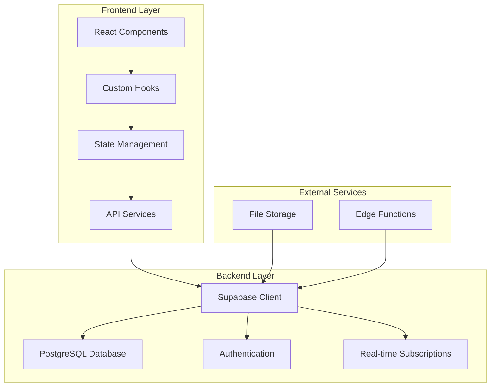
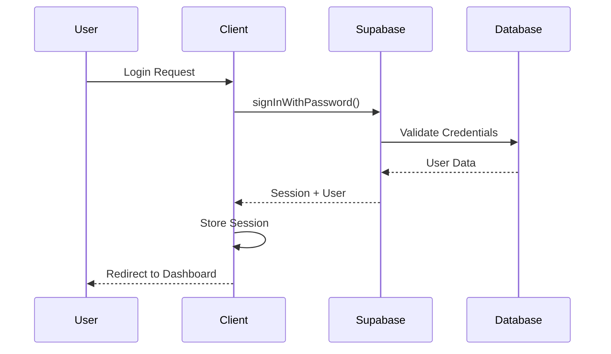

# 🔧 Technical Documentation - Study Tracker

## 📋 Table of Contents

- [🏗️ Architecture Overview](#️-architecture-overview)
- [🔧 Technology Stack](#-technology-stack)
- [📁 Project Structure](#-project-structure)
- [🔐 Authentication System](#-authentication-system)
- [🗄️ Database Schema](#️-database-schema)
- [🎨 UI/UX Implementation](#-uiux-implementation)
- [📱 Responsive Design](#-responsive-design)
- [🚀 Performance Optimization](#-performance-optimization)
- [🧪 Testing Strategy](#-testing-strategy)
- [🔒 Security Implementation](#-security-implementation)
- [📦 Deployment Guide](#-deployment-guide)
- [🐛 Debugging & Troubleshooting](#-debugging--troubleshooting)

---

## 🏗️ Architecture Overview

### System Architecture


### Component Architecture
```typescript
// Component Hierarchy
App
├── AuthProvider
├── ThemeProvider
├── QueryClientProvider
└── Router
    ├── AuthWrapper
    │   ├── ModernNavbar
    │   ├── MainSidebar
    │   ├── FloatingActionButton
    │   └── Routes
    │       ├── Dashboard
    │       ├── StudyPlanner
    │       ├── Flashcards
    │       ├── Analytics
    │       └── Settings
```

---

## 🔧 Technology Stack

### Frontend Technologies

#### Core Framework
- **React 18.2+**: Modern React with hooks and concurrent features
- **TypeScript 5.0+**: Type safety and better developer experience
- **Vite 5.0+**: Fast build tool and development server

#### UI Framework
- **Tailwind CSS 3.3+**: Utility-first CSS framework
- **Shadcn/ui**: Pre-built accessible components
- **Lucide React**: Beautiful icon library
- **Radix UI**: Headless UI primitives

#### State Management
- **React Query**: Server state management and caching
- **React Context**: Client state management
- **Zustand** (optional): Lightweight state management

#### Routing & Navigation
- **React Router DOM 6.8+**: Client-side routing
- **React Location** (alternative): Type-safe routing

### Backend Technologies

#### Backend-as-a-Service
- **Supabase**: Complete backend solution
  - PostgreSQL database
  - Authentication system
  - Real-time subscriptions
  - File storage
  - Edge functions

#### Database
- **PostgreSQL 15+**: Primary database
- **Row Level Security (RLS)**: Data security
- **Database Functions**: Server-side logic

### Development Tools

#### Build & Bundling
- **Vite**: Module bundler and dev server
- **ESBuild**: Fast JavaScript bundler
- **Rollup**: Production bundling

#### Code Quality
- **ESLint**: Code linting
- **Prettier**: Code formatting
- **Husky**: Git hooks
- **Lint-staged**: Pre-commit linting

#### Testing
- **Vitest**: Unit testing framework
- **React Testing Library**: Component testing
- **Cypress**: E2E testing
- **MSW**: API mocking

---

## 📁 Project Structure

```
src/
├── components/                 # Reusable UI components
│   ├── ui/                    # Base UI components (shadcn/ui)
│   │   ├── button.tsx
│   │   ├── card.tsx
│   │   ├── input.tsx
│   │   └── ...
│   ├── auth/                  # Authentication components
│   │   └── LoginForm.tsx
│   ├── layout/                # Layout components
│   │   ├── ModernNavbar.tsx
│   │   ├── MainSidebar.tsx
│   │   ├── Sidebar.tsx
│   │   └── ...
│   └── feature/               # Feature-specific components
│       ├── StudyLogInput.tsx
│       ├── SubjectProgress.tsx
│       ├── StudyHoursChart.tsx
│       └── ...
├── hooks/                     # Custom React hooks
│   ├── useAuth.tsx
│   ├── useDashboard.ts
│   ├── useSubjects.ts
│   ├── useStudyLogs.ts
│   └── ...
├── lib/                       # Utility functions and configurations
│   ├── supabase.ts           # Supabase client configuration
│   ├── utils.ts              # Utility functions
│   └── database.types.ts     # Database type definitions
├── pages/                     # Page components
│   ├── Dashboard.tsx
│   ├── StudyPlanner.tsx
│   ├── Flashcards.tsx
│   ├── Analytics.tsx
│   └── ...
├── services/                  # API services
│   └── api.ts                # Supabase API wrappers
├── types/                     # TypeScript type definitions
│   ├── auth.ts
│   ├── dashboard.ts
│   └── ...
└── styles/                    # Global styles
    └── globals.css
```

### File Naming Conventions

```typescript
// Components: PascalCase
ModernNavbar.tsx
StudyLogInput.tsx

// Hooks: camelCase with use prefix
useAuth.tsx
useDashboard.ts

// Services: camelCase
authService.ts
studyLogService.ts

// Types: PascalCase
User.ts
StudyLog.ts

// Constants: SCREAMING_SNAKE_CASE
API_ENDPOINTS.ts
DEFAULT_VALUES.ts
```

---

## 🔐 Authentication System

### Authentication Flow


### Implementation Details

#### Auth Provider
```typescript
// src/hooks/useAuth.tsx
export function AuthProvider({ children }: { children: React.ReactNode }) {
  const [user, setUser] = useState<User | null>(isDemoMode ? DEMO_USER : null);
  const [loading, setLoading] = useState(!isDemoMode);

  useEffect(() => {
    if (isDemoMode) {
      setUser(DEMO_USER);
      setLoading(false);
      return;
    }

    // Real authentication flow
    const { data: { subscription } } = supabase.auth.onAuthStateChange(
      (event, session) => {
        setUser(session?.user ?? null);
        setLoading(false);
      }
    );

    return () => subscription.unsubscribe();
  }, []);

  return (
    <AuthContext.Provider value={{ user, loading, signIn, signUp, signOut }}>
      {children}
    </AuthContext.Provider>
  );
}
```

#### Route Protection
```typescript
// Protected Route Component
const ProtectedRoute = ({ children }: { children: React.ReactNode }) => {
  const { user, loading } = useAuth();

  if (loading) return <LoadingSpinner />;
  if (!user) return <Navigate to="/login" replace />;
  
  return <>{children}</>;
};
```

#### Demo Mode Implementation
```typescript
// Demo mode for development without Supabase setup
const DEMO_MODE = !supabaseUrl || !supabaseAnonKey;

const DEMO_USER: User = {
  id: 'demo-user-id',
  email: 'demo@example.com',
  created_at: new Date().toISOString(),
  // ... other required fields
};
```

---

## 🗄️ Database Schema

### Core Tables

#### Users Table
```sql
CREATE TABLE users (
  id UUID PRIMARY KEY DEFAULT gen_random_uuid(),
  email TEXT UNIQUE NOT NULL,
  full_name TEXT,
  avatar_url TEXT,
  preferences JSONB DEFAULT '{}',
  created_at TIMESTAMP WITH TIME ZONE DEFAULT NOW(),
  updated_at TIMESTAMP WITH TIME ZONE DEFAULT NOW()
);

-- Enable RLS
ALTER TABLE users ENABLE ROW LEVEL SECURITY;

-- Policy: Users can only access their own data
CREATE POLICY "Users can view own profile" ON users
  FOR SELECT USING (auth.uid() = id);

CREATE POLICY "Users can update own profile" ON users
  FOR UPDATE USING (auth.uid() = id);
```

#### Study Logs Table
```sql
CREATE TABLE study_logs (
  id UUID PRIMARY KEY DEFAULT gen_random_uuid(),
  user_id UUID REFERENCES users(id) ON DELETE CASCADE,
  subject_id UUID REFERENCES subjects(id) ON DELETE CASCADE,
  date DATE NOT NULL,
  hours DECIMAL(4,2) NOT NULL CHECK (hours > 0),
  efficiency INTEGER CHECK (efficiency >= 1 AND efficiency <= 10),
  notes TEXT,
  created_at TIMESTAMP WITH TIME ZONE DEFAULT NOW(),
  updated_at TIMESTAMP WITH TIME ZONE DEFAULT NOW()
);

-- Enable RLS
ALTER TABLE study_logs ENABLE ROW LEVEL SECURITY;

-- Policy: Users can only access their own study logs
CREATE POLICY "Users can manage own study logs" ON study_logs
  FOR ALL USING (auth.uid() = user_id);
```

#### Subjects Table
```sql
CREATE TABLE subjects (
  id UUID PRIMARY KEY DEFAULT gen_random_uuid(),
  user_id UUID REFERENCES users(id) ON DELETE CASCADE,
  name TEXT NOT NULL,
  color TEXT DEFAULT '#60A5FA',
  description TEXT,
  created_at TIMESTAMP WITH TIME ZONE DEFAULT NOW(),
  updated_at TIMESTAMP WITH TIME ZONE DEFAULT NOW()
);

-- Enable RLS
ALTER TABLE subjects ENABLE ROW LEVEL SECURITY;

-- Policy: Users can manage their own subjects
CREATE POLICY "Users can manage own subjects" ON subjects
  FOR ALL USING (auth.uid() = user_id);
```

### Database Functions

#### Update Study Streaks
```sql
CREATE OR REPLACE FUNCTION update_user_streaks(
  p_user_id UUID,
  p_date DATE
)
RETURNS VOID AS $$
BEGIN
  -- Update daily streak
  INSERT INTO streaks (user_id, streak_type, current_streak, last_activity_date)
  VALUES (p_user_id, 'daily', 1, p_date)
  ON CONFLICT (user_id, streak_type)
  DO UPDATE SET
    current_streak = CASE
      WHEN p_date - last_activity_date = 1 THEN current_streak + 1
      WHEN p_date = last_activity_date THEN current_streak
      ELSE 1
    END,
    last_activity_date = p_date,
    longest_streak = GREATEST(longest_streak, current_streak);
END;
$$ LANGUAGE plpgsql;
```

#### Get Weekly Stats
```sql
CREATE OR REPLACE FUNCTION get_weekly_stats(p_user_id UUID, p_start_date DATE)
RETURNS TABLE (
  date DATE,
  total_hours DECIMAL,
  subject_count INTEGER,
  efficiency_avg DECIMAL
) AS $$
BEGIN
  RETURN QUERY
  SELECT 
    sl.date,
    SUM(sl.hours) as total_hours,
    COUNT(DISTINCT sl.subject_id) as subject_count,
    AVG(sl.efficiency) as efficiency_avg
  FROM study_logs sl
  WHERE sl.user_id = p_user_id
    AND sl.date >= p_start_date
    AND sl.date < p_start_date + INTERVAL '7 days'
  GROUP BY sl.date
  ORDER BY sl.date;
END;
$$ LANGUAGE plpgsql;
```

---

## 🎨 UI/UX Implementation

### Design System

#### Color Palette
```css
:root {
  /* Primary Colors */
  --primary: 214 100% 50%;      /* Blue */
  --primary-foreground: 0 0% 100%;
  
  /* Secondary Colors */
  --secondary: 210 40% 96%;     /* Light Blue */
  --secondary-foreground: 222 84% 5%;
  
  /* Accent Colors */
  --accent: 142 76% 36%;        /* Green */
  --accent-foreground: 0 0% 100%;
  
  /* Background */
  --background: 0 0% 100%;      /* White */
  --foreground: 222 84% 5%;     /* Dark */
  
  /* Muted */
  --muted: 210 40% 96%;         /* Light Gray */
  --muted-foreground: 215 16% 47%;
  
  /* Semantic Colors */
  --destructive: 0 84% 60%;     /* Red */
  --success: 142 76% 36%;       /* Green */
  --warning: 38 92% 50%;        /* Orange */
  --info: 214 100% 50%;         /* Blue */
}
```

#### Typography Scale
```css
:root {
  /* Font Families */
  --font-sans: 'Inter', system-ui, sans-serif;
  --font-mono: 'JetBrains Mono', monospace;
  
  /* Font Sizes */
  --text-xs: 0.75rem;     /* 12px */
  --text-sm: 0.875rem;    /* 14px */
  --text-base: 1rem;      /* 16px */
  --text-lg: 1.125rem;    /* 18px */
  --text-xl: 1.25rem;     /* 20px */
  --text-2xl: 1.5rem;     /* 24px */
  --text-3xl: 1.875rem;   /* 30px */
  --text-4xl: 2.25rem;    /* 36px */
  
  /* Line Heights */
  --leading-tight: 1.25;
  --leading-normal: 1.5;
  --leading-relaxed: 1.625;
}
```

#### Spacing System
```css
:root {
  /* Spacing Scale */
  --space-1: 0.25rem;     /* 4px */
  --space-2: 0.5rem;      /* 8px */
  --space-3: 0.75rem;     /* 12px */
  --space-4: 1rem;        /* 16px */
  --space-6: 1.5rem;      /* 24px */
  --space-8: 2rem;        /* 32px */
  --space-12: 3rem;       /* 48px */
  --space-16: 4rem;       /* 64px */
  --space-20: 5rem;       /* 80px */
}
```

### Component Architecture

#### Base Component Pattern
```typescript
// src/components/ui/button.tsx
import * as React from "react";
import { Slot } from "@radix-ui/react-slot";
import { cva, type VariantProps } from "class-variance-authority";
import { cn } from "@/lib/utils";

const buttonVariants = cva(
  "inline-flex items-center justify-center whitespace-nowrap rounded-md text-sm font-medium ring-offset-background transition-colors focus-visible:outline-none focus-visible:ring-2 focus-visible:ring-ring focus-visible:ring-offset-2 disabled:pointer-events-none disabled:opacity-50",
  {
    variants: {
      variant: {
        default: "bg-primary text-primary-foreground hover:bg-primary/90",
        destructive: "bg-destructive text-destructive-foreground hover:bg-destructive/90",
        outline: "border border-input bg-background hover:bg-accent hover:text-accent-foreground",
        secondary: "bg-secondary text-secondary-foreground hover:bg-secondary/80",
        ghost: "hover:bg-accent hover:text-accent-foreground",
        link: "text-primary underline-offset-4 hover:underline",
      },
      size: {
        default: "h-10 px-4 py-2",
        sm: "h-9 rounded-md px-3",
        lg: "h-11 rounded-md px-8",
        icon: "h-10 w-10",
      },
    },
    defaultVariants: {
      variant: "default",
      size: "default",
    },
  }
);

export interface ButtonProps
  extends React.ButtonHTMLAttributes<HTMLButtonElement>,
    VariantProps<typeof buttonVariants> {
  asChild?: boolean;
}

const Button = React.forwardRef<HTMLButtonElement, ButtonProps>(
  ({ className, variant, size, asChild = false, ...props }, ref) => {
    const Comp = asChild ? Slot : "button";
    return (
      <Comp
        className={cn(buttonVariants({ variant, size, className }))}
        ref={ref}
        {...props}
      />
    );
  }
);
Button.displayName = "Button";

export { Button, buttonVariants };
```

#### Feature Component Pattern
```typescript
// src/components/StudyLogInput.tsx
interface StudyLogInputProps {
  onSubmit?: (data: StudyLogFormData) => void;
  loading?: boolean;
}

export function StudyLogInput({ onSubmit, loading = false }: StudyLogInputProps) {
  const { subjects } = useSubjects();
  const { createLog } = useStudyLogs();
  const { toast } = useToast();
  
  const [formData, setFormData] = useState<StudyLogFormData>({
    subject_id: '',
    date: new Date().toISOString().split('T')[0],
    hours: '',
    efficiency: '',
    notes: '',
  });

  const handleSubmit = async (e: React.FormEvent) => {
    e.preventDefault();
    
    try {
      await createLog(formData);
      toast({
        title: 'Study Log Added!',
        description: 'Your study session has been successfully logged.',
      });
      setFormData(initialFormData);
    } catch (error) {
      toast({
        title: 'Error',
        description: 'Failed to add study log. Please try again.',
        variant: 'destructive',
      });
    }
  };

  return (
    <Card>
      <CardHeader>
        <CardTitle>Log Study Session</CardTitle>
      </CardHeader>
      <CardContent>
        <form onSubmit={handleSubmit} className="space-y-4">
          {/* Form fields */}
        </form>
      </CardContent>
    </Card>
  );
}
```

---

## 📱 Responsive Design

### Breakpoint System
```css
/* Tailwind CSS Breakpoints */
sm: 640px    /* Small devices (landscape phones) */
md: 768px    /* Medium devices (tablets) */
lg: 1024px   /* Large devices (laptops) */
xl: 1280px   /* Extra large devices (desktops) */
2xl: 1536px  /* 2X Extra large devices (large desktops) */
```

### Responsive Grid Layouts
```typescript
// Dashboard Grid Component
const DashboardGrid = () => {
  return (
    <div className="grid grid-cols-1 sm:grid-cols-2 lg:grid-cols-4 gap-4">
      <StatsCard />
      <StatsCard />
      <StatsCard />
      <StatsCard />
    </div>
  );
};

// Flashcard Grid Component
const FlashcardGrid = () => {
  return (
    <div className="grid grid-cols-1 sm:grid-cols-2 lg:grid-cols-3 xl:grid-cols-4 gap-4">
      {flashcards.map(card => (
        <Flashcard key={card.id} card={card} />
      ))}
    </div>
  );
};
```

### Mobile-First Approach
```typescript
// Responsive Navigation
const Navigation = () => {
  const [isMobileMenuOpen, setIsMobileMenuOpen] = useState(false);

  return (
    <nav className="flex items-center justify-between p-4">
      {/* Desktop Navigation */}
      <div className="hidden md:flex items-center space-x-8">
        <NavLink to="/dashboard">Dashboard</NavLink>
        <NavLink to="/planner">Planner</NavLink>
        <NavLink to="/flashcards">Flashcards</NavLink>
      </div>

      {/* Mobile Menu Button */}
      <button
        className="md:hidden"
        onClick={() => setIsMobileMenuOpen(!isMobileMenuOpen)}
      >
        <MenuIcon />
      </button>

      {/* Mobile Navigation */}
      {isMobileMenuOpen && (
        <div className="md:hidden absolute top-16 left-0 right-0 bg-background border-t">
          <NavLink to="/dashboard" className="block p-4">Dashboard</NavLink>
          <NavLink to="/planner" className="block p-4">Planner</NavLink>
          <NavLink to="/flashcards" className="block p-4">Flashcards</NavLink>
        </div>
      )}
    </nav>
  );
};
```

### Touch-Friendly Design
```css
/* Touch target sizes */
.touch-target {
  min-height: 44px;
  min-width: 44px;
}

/* Swipe gestures */
.swipe-container {
  touch-action: pan-y;
  overflow-x: auto;
}

/* Haptic feedback */
.haptic-feedback {
  -webkit-tap-highlight-color: transparent;
}
```

---

## 🚀 Performance Optimization

### Code Splitting & Lazy Loading
```typescript
// Lazy load page components
const Dashboard = lazy(() => import('./pages/Dashboard'));
const StudyPlanner = lazy(() => import('./pages/StudyPlanner'));
const Flashcards = lazy(() => import('./pages/Flashcards'));

// Route-based code splitting
const AppRoutes = () => (
  <Routes>
    <Route 
      path="/" 
      element={
        <Suspense fallback={<LoadingSpinner />}>
          <Dashboard />
        </Suspense>
      } 
    />
    <Route 
      path="/planner" 
      element={
        <Suspense fallback={<LoadingSpinner />}>
          <StudyPlanner />
        </Suspense>
      } 
    />
  </Routes>
);
```

### Data Fetching Optimization
```typescript
// React Query configuration
const queryClient = new QueryClient({
  defaultOptions: {
    queries: {
      staleTime: 5 * 60 * 1000, // 5 minutes
      cacheTime: 10 * 60 * 1000, // 10 minutes
      refetchOnWindowFocus: false,
      retry: (failureCount, error) => {
        if (error.status === 404) return false;
        return failureCount < 3;
      },
    },
  },
});

// Optimized data fetching
export function useDashboard() {
  return useQuery({
    queryKey: ['dashboard'],
    queryFn: fetchDashboardData,
    select: (data) => ({
      stats: data.stats,
      recentLogs: data.recentLogs.slice(0, 10), // Only select recent logs
    }),
  });
}
```

### Image Optimization
```typescript
// Optimized image component
const OptimizedImage = ({ src, alt, ...props }) => {
  const [loaded, setLoaded] = useState(false);
  const [error, setError] = useState(false);

  return (
    <div className="relative">
      {!loaded && !error && (
        <div className="absolute inset-0 bg-muted animate-pulse rounded" />
      )}
       setLoaded(true)}
        onError={() => setError(true)}
        className={`transition-opacity duration-300 ${
          loaded ? 'opacity-100' : 'opacity-0'
        }`}
        {...props}
      />
    </div>
  );
};
```

### Bundle Optimization
```typescript
// vite.config.ts
export default defineConfig({
  build: {
    rollupOptions: {
      output: {
        manualChunks: {
          vendor: ['react', 'react-dom'],
          ui: ['@radix-ui/react-dialog', '@radix-ui/react-dropdown-menu'],
          charts: ['recharts', 'd3'],
        },
      },
    },
  },
  optimizeDeps: {
    include: ['react', 'react-dom', 'react-router-dom'],
  },
});
```

---

## 🧪 Testing Strategy

### Unit Testing
```typescript
// src/hooks/__tests__/useAuth.test.ts
import { renderHook, act } from '@testing-library/react';
import { useAuth } from '../useAuth';

describe('useAuth', () => {
  it('should return user when authenticated', async () => {
    const { result } = renderHook(() => useAuth());
    
    expect(result.current.loading).toBe(true);
    
    await act(async () => {
      // Simulate authentication
    });
    
    expect(result.current.user).toBeTruthy();
    expect(result.current.loading).toBe(false);
  });
});
```

### Component Testing
```typescript
// src/components/__tests__/StudyLogInput.test.tsx
import { render, screen, fireEvent, waitFor } from '@testing-library/react';
import { StudyLogInput } from '../StudyLogInput';

describe('StudyLogInput', () => {
  it('should submit form with valid data', async () => {
    render(<StudyLogInput />);
    
    fireEvent.change(screen.getByLabelText(/subject/i), {
      target: { value: 'React Development' }
    });
    fireEvent.change(screen.getByLabelText(/hours/i), {
      target: { value: '2.5' }
    });
    
    fireEvent.click(screen.getByRole('button', { name: /add study log/i }));
    
    await waitFor(() => {
      expect(screen.getByText(/study log added/i)).toBeInTheDocument();
    });
  });
});
```

### Integration Testing
```typescript
// cypress/integration/dashboard.spec.ts
describe('Dashboard', () => {
  beforeEach(() => {
    cy.visit('/dashboard');
  });

  it('should display study statistics', () => {
    cy.get('[data-testid="stats-card"]').should('have.length', 4);
    cy.get('[data-testid="total-hours"]').should('contain', '24.5');
  });

  it('should allow adding new study log', () => {
    cy.get('[data-testid="add-log-button"]').click();
    cy.get('[data-testid="subject-select"]').select('React Development');
    cy.get('[data-testid="hours-input"]').type('2.5');
    cy.get('[data-testid="submit-button"]').click();
    
    cy.get('[data-testid="success-message"]').should('be.visible');
  });
});
```

### E2E Testing
```typescript
// cypress/e2e/study-flow.cy.ts
describe('Complete Study Flow', () => {
  it('should complete a full study session', () => {
    // Login
    cy.visit('/login');
    cy.get('[data-testid="email-input"]').type('test@example.com');
    cy.get('[data-testid="password-input"]').type('password123');
    cy.get('[data-testid="login-button"]').click();

    // Navigate to dashboard
    cy.url().should('include', '/dashboard');
    
    // Add study log
    cy.get('[data-testid="quick-add-log"]').click();
    cy.get('[data-testid="subject-select"]').select('Mathematics');
    cy.get('[data-testid="hours-input"]').type('1.5');
    cy.get('[data-testid="notes-textarea"]').type('Studied calculus');
    cy.get('[data-testid="submit-button"]').click();
    
    // Verify log was added
    cy.get('[data-testid="recent-logs"]').should('contain', 'Mathematics');
    cy.get('[data-testid="recent-logs"]').should('contain', '1.5h');
  });
});
```

---

## 🔒 Security Implementation

### Authentication Security
```typescript
// JWT token validation
const validateToken = (token: string) => {
  try {
    const payload = jwt.decode(token);
    const now = Math.floor(Date.now() / 1000);
    
    if (payload.exp < now) {
      throw new Error('Token expired');
    }
    
    return payload;
  } catch (error) {
    throw new Error('Invalid token');
  }
};

// Session management
const sessionManager = {
  getSession: () => {
    const token = localStorage.getItem('auth_token');
    if (!token) return null;
    
    try {
      return validateToken(token);
    } catch {
      localStorage.removeItem('auth_token');
      return null;
    }
  },
  
  setSession: (token: string) => {
    localStorage.setItem('auth_token', token);
  },
  
  clearSession: () => {
    localStorage.removeItem('auth_token');
  }
};
```

### Input Validation
```typescript
// Form validation schema
const studyLogSchema = z.object({
  subject_id: z.string().min(1, 'Subject is required'),
  date: z.string().regex(/^\d{4}-\d{2}-\d{2}$/, 'Invalid date format'),
  hours: z.number().min(0.1, 'Hours must be at least 0.1').max(24, 'Hours cannot exceed 24'),
  efficiency: z.number().min(1).max(10).optional(),
  notes: z.string().max(1000, 'Notes cannot exceed 1000 characters').optional(),
});

// Sanitize user input
const sanitizeInput = (input: string) => {
  return input
    .trim()
    .replace(/<script\b[^<]*(?:(?!<\/script>)<[^<]*)*<\/script>/gi, '')
    .replace(/javascript:/gi, '')
    .replace(/on\w+\s*=/gi, '');
};
```

### Row Level Security (RLS)
```sql
-- Enable RLS on all tables
ALTER TABLE users ENABLE ROW LEVEL SECURITY;
ALTER TABLE study_logs ENABLE ROW LEVEL SECURITY;
ALTER TABLE subjects ENABLE ROW LEVEL SECURITY;

-- Users can only access their own data
CREATE POLICY "Users can view own profile" ON users
  FOR SELECT USING (auth.uid() = id);

CREATE POLICY "Users can update own profile" ON users
  FOR UPDATE USING (auth.uid() = id);

-- Study logs are private to each user
CREATE POLICY "Users can manage own study logs" ON study_logs
  FOR ALL USING (auth.uid() = user_id);

-- Subjects are private to each user
CREATE POLICY "Users can manage own subjects" ON subjects
  FOR ALL USING (auth.uid() = user_id);
```

---

## 📦 Deployment Guide

### Environment Setup
```bash
# .env.production
VITE_SUPABASE_URL=https://your-project.supabase.co
VITE_SUPABASE_ANON_KEY=your-anon-key
VITE_APP_VERSION=1.0.0
VITE_APP_ENVIRONMENT=production
```

### Build Process
```bash
# Install dependencies
npm ci

# Run tests
npm run test

# Build for production
npm run build

# Preview production build
npm run preview
```

### Vercel Deployment
```json
// vercel.json
{
  "buildCommand": "npm run build",
  "outputDirectory": "dist",
  "framework": "vite",
  "rewrites": [
    {
      "source": "/(.*)",
      "destination": "/index.html"
    }
  ],
  "env": {
    "VITE_SUPABASE_URL": "@supabase_url",
    "VITE_SUPABASE_ANON_KEY": "@supabase_anon_key"
  }
}
```

### Docker Deployment
```dockerfile
# Dockerfile
FROM node:18-alpine AS builder

WORKDIR /app
COPY package*.json ./
RUN npm ci --only=production

COPY . .
RUN npm run build

FROM nginx:alpine
COPY --from=builder /app/dist /usr/share/nginx/html
COPY nginx.conf /etc/nginx/nginx.conf

EXPOSE 80
CMD ["nginx", "-g", "daemon off;"]
```

```nginx
# nginx.conf
server {
    listen 80;
    server_name localhost;
    root /usr/share/nginx/html;
    index index.html;

    location / {
        try_files $uri $uri/ /index.html;
    }

    location /api {
        proxy_pass https://your-project.supabase.co;
        proxy_set_header Host $host;
        proxy_set_header X-Real-IP $remote_addr;
    }
}
```

---

## 🐛 Debugging & Troubleshooting

### Common Issues

#### Authentication Issues
```typescript
// Debug authentication state
const debugAuth = () => {
  console.log('Auth State:', {
    user: authService.getCurrentUser(),
    session: supabase.auth.getSession(),
    isDemoMode: isDemoMode,
  });
};

// Add to useEffect for debugging
useEffect(() => {
  debugAuth();
}, []);
```

#### Database Connection Issues
```typescript
// Test database connection
const testConnection = async () => {
  try {
    const { data, error } = await supabase
      .from('users')
      .select('count')
      .limit(1);
    
    if (error) {
      console.error('Database connection failed:', error);
    } else {
      console.log('Database connection successful');
    }
  } catch (error) {
    console.error('Connection test failed:', error);
  }
};
```

#### Performance Issues
```typescript
// Performance monitoring
const performanceMonitor = {
  startTimer: (name: string) => {
    performance.mark(`${name}-start`);
  },
  
  endTimer: (name: string) => {
    performance.mark(`${name}-end`);
    performance.measure(name, `${name}-start`, `${name}-end`);
    
    const measure = performance.getEntriesByName(name)[0];
    console.log(`${name}: ${measure.duration}ms`);
  }
};

// Usage
performanceMonitor.startTimer('data-fetch');
const data = await fetchData();
performanceMonitor.endTimer('data-fetch');
```

### Error Boundaries
```typescript
// Global error boundary
class ErrorBoundary extends React.Component {
  constructor(props) {
    super(props);
    this.state = { hasError: false, error: null };
  }

  static getDerivedStateFromError(error) {
    return { hasError: true, error };
  }

  componentDidCatch(error, errorInfo) {
    console.error('Error caught by boundary:', error, errorInfo);
    
    // Log to error reporting service
    if (process.env.NODE_ENV === 'production') {
      // Send to error reporting service
    }
  }

  render() {
    if (this.state.hasError) {
      return (
        <div className="error-boundary">
          <h2>Something went wrong</h2>
          <p>Please refresh the page or contact support.</p>
          <button onClick={() => window.location.reload()}>
            Refresh Page
          </button>
        </div>
      );
    }

    return this.props.children;
  }
}
```

### Development Tools
```typescript
// Development utilities
const devTools = {
  // Clear all data
  clearAllData: () => {
    localStorage.clear();
    sessionStorage.clear();
    indexedDB.deleteDatabase('supabase');
  },
  
  // Mock data generator
  generateMockData: () => {
    const mockLogs = Array.from({ length: 30 }, (_, i) => ({
      id: `mock-${i}`,
      subject_id: `subject-${i % 5}`,
      date: new Date(Date.now() - i * 24 * 60 * 60 * 1000).toISOString().split('T')[0],
      hours: Math.random() * 4 + 0.5,
      efficiency: Math.floor(Math.random() * 10) + 1,
      notes: `Mock study session ${i}`,
    }));
    
    return mockLogs;
  },
  
  // Performance profiler
  profile: (name: string, fn: () => void) => {
    const start = performance.now();
    fn();
    const end = performance.now();
    console.log(`${name} took ${end - start} milliseconds`);
  }
};

// Make available in development
if (process.env.NODE_ENV === 'development') {
  (window as any).devTools = devTools;
}
```

---

## 📚 Additional Resources

### Documentation Links
- [React Documentation](https://reactjs.org/docs)
- [TypeScript Handbook](https://www.typescriptlang.org/docs)
- [Tailwind CSS Docs](https://tailwindcss.com/docs)
- [Supabase Documentation](https://supabase.com/docs)
- [Vite Guide](https://vitejs.dev/guide)

### Best Practices
- [React Best Practices](https://react.dev/learn)
- [TypeScript Best Practices](https://typescript-eslint.io/rules/)
- [Accessibility Guidelines](https://www.w3.org/WAI/WCAG21/quickref/)
- [Performance Best Practices](https://web.dev/performance/)

### Community Resources
- [React Community](https://reactjs.org/community/support.html)
- [Supabase Discord](https://discord.supabase.com)
- [Tailwind CSS Discord](https://discord.gg/tailwindcss)

---

This technical documentation provides a comprehensive guide for developers working on the Study Tracker application. It covers all aspects from architecture to deployment, ensuring maintainable and scalable code.
